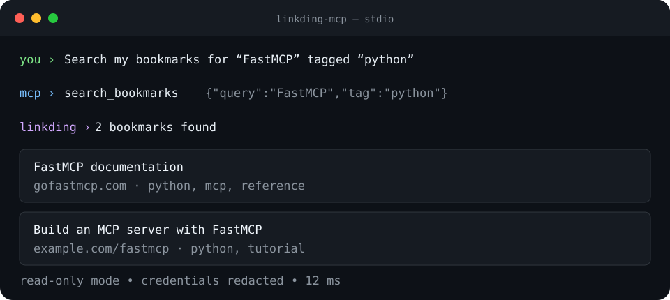

# LinkDing MCP Server

[](https://github.com/jon-the-dev/linkding-mcp-server/actions/workflows/ci.yml)
[](https://www.python.org/downloads/)
[](LICENSE)

A Model Context Protocol (MCP) server that lets compatible AI clients search and
manage bookmarks in a self-hosted [LinkDing](https://github.com/sissbruecker/linkding)
instance.



## Why this exists

LinkDing is a useful home for durable, self-hosted bookmarks, but bookmarks are
most valuable when they are available inside the tools where research happens.
This server provides a small, typed MCP bridge instead of requiring an AI client
to know LinkDing's REST API or handle credentials directly.

It supports search, lookup, creation, updates, deletion, archive operations, URL
checks, and tag browsing. Write operations are disabled by default.

## Quickstart

You need Python 3.12+, [uv](https://docs.astral.sh/uv/), a running LinkDing
instance, and a LinkDing API token.

```bash
git clone https://github.com/jon-the-dev/linkding-mcp-server.git
cd linkding-mcp-server
uv sync
cp .env.sample .env
```

Set these values in `.env`:

```dotenv
LINKDING_URL=https://links.example.com
LINKDING_API_TOKEN=replace-with-your-token
LINKDING_ENABLE_DESTRUCTIVE_ACTIONS=false
```

Start the stdio MCP server:

```bash
uv run linkding-mcp
```

The package has not been published to PyPI yet. GitHub/source installation is
the supported path until the first release is published.

## Client configuration

For Claude Desktop, add an entry like this to its MCP configuration. Replace the
repository path and credential values with your own:

```json
{
  "mcpServers": {
    "linkding": {
      "command": "uv",
      "args": [
        "--directory",
        "/absolute/path/to/linkding-mcp-server",
        "run",
        "linkding-mcp"
      ],
      "env": {
        "LINKDING_URL": "https://links.example.com",
        "LINKDING_API_TOKEN": "replace-with-your-token",
        "LINKDING_ENABLE_DESTRUCTIVE_ACTIONS": "false"
      }
    }
  }
}
```

Restart the client after changing its configuration. Other clients can launch
the same `uv run linkding-mcp` command over stdio.

## Examples

Once connected, natural-language requests map to the server's MCP tools:

```text
Search my bookmarks for "FastMCP" tagged "python".
Check whether https://modelcontextprotocol.io is already bookmarked.
List my LinkDing tags.
```

Write requests require `LINKDING_ENABLE_DESTRUCTIVE_ACTIONS=true`:

```text
Save https://example.com with tags "reference" and "demo".
Archive bookmark 42.
```

The ten exposed tools are:

- `search_bookmarks`
- `add_bookmark`
- `get_bookmark`
- `update_bookmark`
- `delete_bookmark`
- `archive_bookmark`
- `unarchive_bookmark`
- `check_url`
- `list_tags`
- `list_bookmarks_by_tag`

See the [full documentation](https://jon-the-dev.github.io/linkding-mcp-server/)
for parameters, configuration, and client-specific setup.

## Security and credentials

- Create a dedicated LinkDing token when possible and store it only in `.env`
  or your MCP client's local secret/configuration store.
- Never commit `.env`, tokens, or client-local settings. `.env` and
  `.claude/settings.local.json` are ignored by this repository.
- Keep `LINKDING_ENABLE_DESTRUCTIVE_ACTIONS=false` for read-only use. Enabling it
  permits add, update, delete, archive, and unarchive operations.
- Leave TLS verification enabled in production. A custom CA bundle is supported
  for private certificate authorities.
- Tokens are masked in logs and structured telemetry is disabled by default.

Report vulnerabilities privately through
[GitHub Security Advisories](https://github.com/jon-the-dev/linkding-mcp-server/security/advisories/new).
Do not include credentials in reports.

## Configuration

| Variable | Default | Description |
| --- | --- | --- |
| `LINKDING_URL` | `http://127.0.0.1:9090` | LinkDing base URL |
| `LINKDING_API_TOKEN` | required | LinkDing API token |
| `LINKDING_ENABLE_DESTRUCTIVE_ACTIONS` | `false` | Permit write and delete tools |
| `LINKDING_VERIFY_SSL` | `true` | Verify TLS certificates |
| `LINKDING_SSL_CERT_PATH` | unset | Optional custom CA bundle |
| `LINKDING_REQUEST_TIMEOUT` | `30` | Request timeout in seconds |
| `LINKDING_MAX_RETRIES` | `3` | Retry attempts |
| `LINKDING_CACHE_TTL` | `300` | Cache lifetime in seconds |
| `LINKDING_CACHE_MAX_SIZE` | `100` | Maximum LRU cache entries |
| `LINKDING_OBSERVABILITY_ENABLED` | `false` | Emit redacted metric events |
| `LINKDING_LOG_LEVEL` | `INFO` | Python log level |

See [.env.sample](.env.sample) for every option.

## Known limitations

- The first PyPI release is not published yet; install from source.
- A running LinkDing instance and API token are required for real operations.
- Rate limiting and in-memory caching are process-local, so replicas do not
  share limits or cache state.
- The server targets LinkDing API v1 and does not provide a hosted LinkDing
  service.
- Destructive actions are a single configuration gate, not per-tool policy.

## Development

```bash
uv sync --extra dev
uv run ruff check linkding_mcp_server tests
uv run mypy linkding_mcp_server
uv run pytest -m "not performance" \
  --cov=linkding_mcp_server \
  --cov-report=term-missing \
  --cov-fail-under=90
uv run pytest -m performance --durations=10
```

The integration suite uses an injected `httpx.MockTransport`, so it exercises
all ten MCP tools without requiring a live LinkDing server.

Contributions and bug reports are welcome. Please add tests for behavior changes
and never include live credentials or private bookmark data in fixtures.

## License

Copyright © 2024–2026 Jon Price and contributors.

Licensed under the [GNU Affero General Public License v3.0 only](LICENSE).
The software is provided without warranty; see the license for the complete
terms and limitation of liability.
